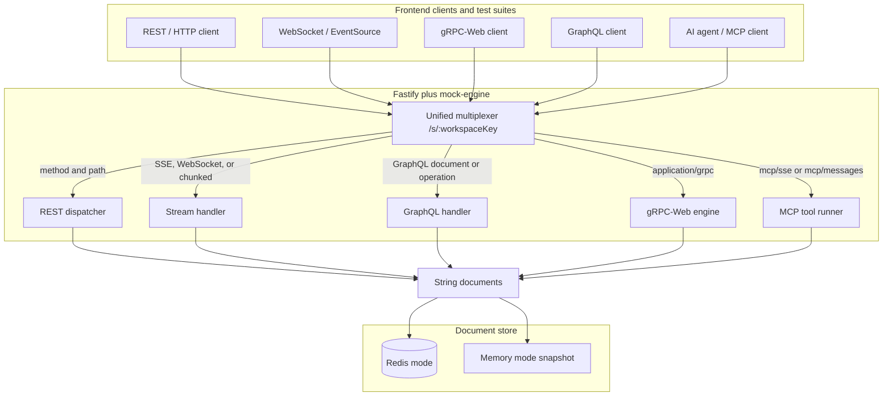

# @mockmarlin/mock-engine

Fastify plugin that multiplexes one URL prefix onto mock REST, streaming, GraphQL, gRPC-Web, and MCP documents.

[](https://www.npmjs.com/package/@mockmarlin/mock-engine)
[](LICENSE)
[](https://github.com/Mock-Marlin/mock-engine)
[](https://mockmarlin.com)

> Don't want to self-host and manage Redis? Spin up visual workspaces instantly at [MockMarlin](https://mockmarlin.com).

One Fastify prefix serves every protocol from one document store. **Redis mode** uses a single Redis instance. **Memory mode** uses a static snapshot copied at startup, so the same documents run with no Redis process. The plugin reads documents. Your app writes them. It does not evaluate rules or open a database.

Requires Node.js 24 or newer and Fastify 5. Register `@fastify/websocket` before the plugin, and pass the same store options to both.

## Architecture

Public traffic is `{basePath}/{workspaceKey}/...`. The default base path is `/s`, so a workspace key of `demo` is served at `/s/demo/...`. The first matching protocol wins: MCP paths, then `Content-Type: application/grpc`, then SSE / WebSocket / chunked streams, then GraphQL, then REST.



Both stores hold the same strings: route indexes, mock bodies, stream plans, GraphQL SDL, proto stubs, and MCP catalogs. Redis mode can refresh key expiry on read. Memory mode copies `data` once and ignores expiry. MCP sessions stay in the process either way. They are not in the document store.

## Quickstart

### Memory mode

```bash
npm install @mockmarlin/mock-engine fastify @fastify/websocket
```

```ts
import Fastify from "fastify";
import websocket from "@fastify/websocket";
import { createKeyLayout, mockEngine, mockEngineWebsocketOptions } from "@mockmarlin/mock-engine";

const keys = createKeyLayout();
const workspaceId = "demo";

const engine = {
  mode: "memory" as const,
  data: {
    [keys.route(workspaceId, "GET", "/hello")]: "hello-1",
    [keys.mock("hello-1")]: JSON.stringify({
      statusCode: 200,
      delayMs: 40,
      fault: "none",
      payload: {
        type: "json",
        storage: "inline",
        body: JSON.stringify({ ok: true }),
      },
    }),
  },
  resolveWorkspaceId: async (workspaceKey: string) => {
    return workspaceKey === "demo" ? workspaceId : null;
  },
};

const app = Fastify();
await app.register(websocket, { options: mockEngineWebsocketOptions(engine) });
await app.register(mockEngine, engine);
await app.listen({ port: 3000, host: "127.0.0.1" });
```

`GET http://127.0.0.1:3000/s/demo/hello` waits 40ms and returns `{ "ok": true }`.

`resolveWorkspaceId` turns the first path segment into the id stored in document keys. Return `null` for an unknown workspace and the plugin responds with 404 without reading the store. `data` is copied when the plugin and the WebSocket handshake open. Later edits to that object do not change a running server.

### Redis mode

```bash
npm install @mockmarlin/mock-engine fastify @fastify/websocket ioredis
```

```ts
import Fastify from "fastify";
import websocket from "@fastify/websocket";
import Redis from "ioredis";
import { createKeyLayout, mockEngine, mockEngineWebsocketOptions } from "@mockmarlin/mock-engine";

const redis = new Redis("redis://127.0.0.1:6379");
const keys = createKeyLayout();
const workspaceId = "demo";

const engine = {
  redis,
  resolveWorkspaceId: async (workspaceKey: string) => {
    return workspaceKey === "demo" ? workspaceId : null;
  },
};

await redis.set(keys.route(workspaceId, "GET", "/hello"), "hello-1");
await redis.set(
  keys.mock("hello-1"),
  JSON.stringify({
    statusCode: 200,
    delayMs: 40,
    fault: "none",
    payload: {
      type: "json",
      storage: "inline",
      body: JSON.stringify({ ok: true }),
    },
  }),
);

const app = Fastify();
await app.register(websocket, { options: mockEngineWebsocketOptions(engine) });
await app.register(mockEngine, engine);
await app.listen({ port: 3000, host: "127.0.0.1" });
```

Omit `mode` and the plugin uses Redis. The client is yours: the plugin does not construct it and does not call `quit`.

## Supported protocols

Documents are identical in both modes. Key names below use the default prefix `mockmarlin`. Full shapes are in [docs/redis.md](docs/redis.md).

### REST and dynamic rules

`GET`, `HEAD`, `POST`, `PUT`, `PATCH`, and `DELETE` look up `{prefix}:route:{workspaceId}:{METHOD}:{path}`, then the mock document that id points at.

```json
{
  "statusCode": 200,
  "delayMs": 40,
  "fault": "none",
  "template": false,
  "payload": {
    "type": "json",
    "storage": "inline",
    "body": "{\"ok\":true}"
  }
}
```

`delayMs` waits before the body. `fault` is `none`, `hang` (hold the socket), `reset` (destroy the socket), or `partial` (write about 30 percent, then close). `template: true` expands `{{method}}`, `{{path}}`, `{{uuid}}`, `{{now}}`, `{{header.Name}}`, `{{query.name}}`, and `{{body.name}}` in an inline text body and in header values.

The plugin does not evaluate rules or datasets. Pass `resolvePayloadOverride` when the host should replace a stored document for a request. Return `null` to send the document as stored.

### WebSockets and streaming

One stream document per path. `protocol` is `sse`, `websocket`, or `chunked`. Without it, the document is ignored.

SSE uses `text/event-stream`. Chunked HTTP uses the content type for `chunkedFormat`. WebSocket upgrades use the same URL. `dropConnectionAtPercent` closes after that percent of the planned chunks. Other delivery fields (`chunkMode`, heartbeats, `Last-Event-ID` resume, loop, subprotocols, echo) are in [docs/redis.md](docs/redis.md).

### GraphQL

The GraphQL document stores a non-empty `sdl` string. A `GET` with `Accept: text/html` and no `query` returns the playground. Other calls read the operation from a JSON body, an `application/graphql` body, or the `query` query parameter. Subscriptions on the same URL use the `graphql-transport-ws` subprotocol.

### gRPC stubbing

Unary gRPC-Web only. The path after the workspace key is `{package.Service}/{Method}`. The hot document carries `responsePayload`, `latencyMs`, and an optional `errorCode`. Proto file text lives in the schema document and is loaded with `@grpc/proto-loader`. Streaming RPCs return `UNIMPLEMENTED`.

### MCP tool sandboxing

`GET {basePath}/{workspaceKey}/mcp/sse` opens the SSE session. `POST {basePath}/{workspaceKey}/mcp/messages?sessionId=...` accepts JSON-RPC (`initialize`, `ping`, `tools/list`, `resources/list`, `prompts/list`, `tools/call`). The workspace catalog is one document of `tools`, `resources`, and `prompts`. A tool's `payload` is what `tools/call` returns when `resolvePayloadOverride` is omitted or returns `null`.

Sessions live in the process. They do not survive a restart and they are not shared across processes.

## Configuration

Pass the same `mode`, store, `basePath`, key names, `ttl`, and `protocols` to `mockEngine` and `mockEngineWebsocketOptions`.

| Option | Default | Role |
|---|---|---|
| `mode` | `"redis"` | `"memory"` serves `data` and does not contact Redis. |
| `redis` | required in Redis mode | `ioredis` client. The plugin does not construct one. |
| `data` | required in memory mode | `Record<string, string>` copied at startup. `ttl` is ignored. |
| `resolveWorkspaceId` | required | URL segment to workspace id, or `null` for 404. |
| `basePath` | `/s` | Public prefix. Workspaces live at `{basePath}/{workspaceKey}/...`. |
| `keyPrefix` | `mockmarlin` | Key namespace. Ignored when `keys` is set. |
| `keys` | layout from `keyPrefix` | Full `KeyLayout` override. |
| `ttl` | none | Redis only. `EXPIRE` seconds after a successful read, per key kind. |
| `protocols` | all on | `rest`, `stream`, `graphql`, `mcp`, `grpc`. Set a field to `false` to skip it. |
| `resolvePayloadOverride` | none | Host rules and datasets. Return `null` to serve the stored document. |
| `onInspectorLog` | none | Fire-and-forget log for accepted REST responses and stream connections. |
| `readStoredObject` | none | Readable for REST payloads with `storage: "object"`. |

Field-by-field detail is in [docs/configuration.md](docs/configuration.md).

## What to read next

| Guide | What it covers |
|---|---|
| [docs/setup.md](docs/setup.md) | Install, the first mock, and the options most apps set |
| [docs/configuration.md](docs/configuration.md) | Every option: mode, URLs, keys, TTLs, protocols, callbacks |
| [docs/api.md](docs/api.md) | Each export, what the caller passes, and what it returns |
| [docs/redis.md](docs/redis.md) | Key names and the JSON each protocol expects |
| [docs/internals.md](docs/internals.md) | How a request is dispatched and what each handler does |

## Contributing

Issues and pull requests: [github.com/Mock-Marlin/mock-engine](https://github.com/Mock-Marlin/mock-engine).

Use Node.js 24 or newer.

```bash
npm test
npm run lint
npm run build
```

`npm test` runs Vitest against a real Fastify app. Redis tests use `ioredis-mock`. Memory tests register the plugin with `mode: "memory"` and no Redis client. `npm run lint` typechecks the source and the tests. `npm run build` emits `dist/` with declarations.

## License

[MIT](LICENSE) © 2026 MockMarlin
